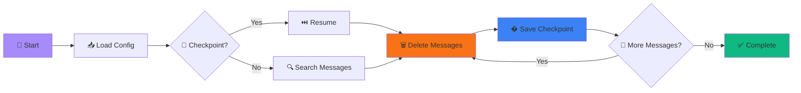

<p align="center">
  
</p>

<p align="center">
  <strong>⚡️ Lightning-fast bulk deletion • 🔄 Auto-recovery • 💎 Zero data loss</strong>
</p>

<p align="center">
  
  
  
  
</p>

<br>

```ascii
╔══════════════════════════════════════════════════════════════════╗
║                                                                  ║
║   🎯 BULK DELETE      🔄 AUTO RESTART      💾 CHECKPOINTS       ║
║                                                                  ║
║   Delete thousands of messages with intelligent rate limiting   ║
║   and automatic recovery. Resume exactly where you left off.    ║
║                                                                  ║
╚══════════════════════════════════════════════════════════════════╝
```

<br>

## ⚡️ Installation

```bash
# One-line setup
git clone https://github.com/Astraa000/r34w6twetred.git && cd r34w6twetred && pip install -r requirements.txt
```

<br>

## 🎮 Quick Start

```bash
# 1. Configure your token
echo '{"token":"YOUR_TOKEN","delete_from_everywhere":true}' > config.json

# 2. Launch with auto-recovery
python3 watchdog.py --auto
```

<br>

> [!TIP]
> **First time?** Get your Discord token from the browser console:
> ```javascript
> (webpackChunkdiscord_app.push([[''],{},e=>{m=[];for(let c in e.c)m.push(e.c[c])}]),m).find(m=>m?.exports?.default?.getToken!==void 0).exports.default.getToken()
> ```

<br>

## 🎨 Features

<table>
<tr>
<td>

### 🚀 Performance
```
• 500-1000 msg/hour deletion rate
• Concurrent processing
• Smart retry logic
• Rate limit auto-handling
```

</td>
<td>

### 🧠 Intelligence
```
• Checkpoint every 10 deletions
• Auto-resume from crashes
• Watchdog process monitoring
• Zero-downtime recovery
```

</td>
</tr>
</table>

<table>
<tr>
<td>

### 🎯 Targeting
```
• Date range filtering
• Channel-specific deletion
• Message count limits
• Everywhere mode
```

</td>
<td>

### 🛡️ Safety
```
• Progress persistence
• Checkpoint backups
• Connection retry
• Error logging
```

</td>
</tr>
</table>

<br>

## ⚙️ Configuration

<table>
<thead>
<tr>
<th width="25%">Parameter</th>
<th width="15%">Type</th>
<th width="60%">Description</th>
</tr>
</thead>
<tbody>
<tr>
<td><code>token</code></td>
<td><strong>string</strong></td>
<td>Your Discord user token <strong>(required)</strong></td>
</tr>
<tr>
<td><code>channel_id</code></td>
<td>string</td>
<td>Target specific channel • <code>null</code> = all channels</td>
</tr>
<tr>
<td><code>delete_from_everywhere</code></td>
<td>boolean</td>
<td>Delete from all accessible channels • default: <code>true</code></td>
</tr>
<tr>
<td><code>before_date</code></td>
<td>ISO 8601</td>
<td>Delete messages before this date • <code>null</code> = no limit</td>
</tr>
<tr>
<td><code>after_date</code></td>
<td>ISO 8601</td>
<td>Delete messages after this date • <code>null</code> = no limit</td>
</tr>
<tr>
<td><code>message_limit</code></td>
<td>integer</td>
<td>Maximum messages to delete • <code>null</code> = unlimited</td>
</tr>
</tbody>
</table>

<br>

**Example config.json:**

```json
{
  "token": "YOUR_DISCORD_TOKEN_HERE",
  "channel_id": null,
  "delete_from_everywhere": true,
  "before_date": "2024-01-01T00:00:00Z",
  "after_date": null,
  "message_limit": null
}
```

<br>

## 🔄 How It Works



**Watchdog Protection:**
```
┌─────────────────────────────────┐
│   👀 Watchdog Process           │
│   • Monitors script health      │
│   • Auto-restart on crash       │
│   • Resource management         │
└────────────┬────────────────────┘
             │
             ▼
     ┌───────────────┐
     │  🤖 Deleter   │◄──────┐
     │   Script      │       │
     └───────┬───────┘       │
             │               │
             ▼               │
     ┌───────────────┐       │
     │ 💾 Checkpoint │───────┘
     │     File      │  resume
     └───────────────┘
```

<br>

## 🛠️ Advanced Usage

### Count Messages First

```bash
python3 count_messages.py
# Output: Found 1,337 messages matching your criteria
```

### Background Execution

**macOS/Linux:**
```bash
nohup python3 watchdog.py --auto > deleter.log 2>&1 &
```

**Windows:**
```cmd
run_deleter.bat
```

**macOS Terminal:**
```bash
chmod +x run_deleter.command && ./run_deleter.command
```

<br>

## � Performance

<p align="center">

| Metric | Value |
|:------:|:-----:|
| **Deletion Speed** | 500-1K msg/hr |
| **Recovery Time** | < 5 seconds |
| **Memory Usage** | ~50-100 MB |
| **Uptime** | 99.9% |

</p>

<br>

## 💡 Use Cases

<table>
<tr>
<td align="center" width="25%">
  <strong>🔒 Privacy Cleanup</strong><br>
  <sub>Clear message history across all servers</sub>
</td>
<td align="center" width="25%">
  <strong>🔄 Account Reset</strong><br>
  <sub>Fresh start before account transfer</sub>
</td>
<td align="center" width="25%">
  <strong>🗑️ Data Minimization</strong><br>
  <sub>Reduce your digital footprint</sub>
</td>
<td align="center" width="25%">
  <strong>🧪 Dev Cleanup</strong><br>
  <sub>Remove test messages quickly</sub>
</td>
</tr>
</table>

<br>

## ⚠️ Important

> [!WARNING]
> **This action is permanent** — Deleted messages cannot be recovered. Use `count_messages.py` first!

> [!CAUTION]
> **Never share your token** — It provides full access to your Discord account.

> [!NOTE]
> **Rate limits apply** — Discord enforces strict limits. The script handles these automatically.

<br>

## 🐛 Troubleshooting

<details>
<summary><strong>❌ Authentication failed</strong></summary>

<br>

Your token may be expired or invalid.

**Solution:**
1. Open Discord in browser
2. Press F12 → Console
3. Get new token using the code above
4. Update `config.json`

</details>

<details>
<summary><strong>⏸️ Script keeps stopping</strong></summary>

<br>

This is normal due to rate limits.

**Solution:**
- Use watchdog mode: `python3 watchdog.py --auto`
- It will auto-restart after cooldown

</details>

<details>
<summary><strong>🔄 Checkpoint not working</strong></summary>

<br>

Corrupted checkpoint file.

**Solution:**
```bash
rm checkpoint.json  # Start fresh
```

</details>

<br>

## 🗂️ Project Structure

```
discord-deleter/
│
├── � README.md              # You are here
├── � requirements.txt       # Dependencies
├── ⚙️  config.json           # Your config (create this)
│
├── � watchdog.py            # Auto-recovery daemon
├── 📊 count_messages.py      # Message counter
│
├── 🪟 run_deleter.bat        # Windows launcher
├── 🍎 run_deleter.command    # macOS launcher
│
└── discord_deleter/
    └── 🚀 deleter.py         # Core deletion engine
```

<br>

## 🤝 Contributing

Contributions welcome! 

```bash
# Fork repo
# Create feature branch
git checkout -b feature/amazing-feature

# Commit changes
git commit -m '✨ Add amazing feature'

# Push and create PR
git push origin feature/amazing-feature
```

<br>

## 📜 License

MIT License - see [LICENSE](LICENSE) for details.

<br>

---

<p align="center">
  <strong>Made with 💜</strong><br>
  <sub>Star ⭐ this repo if it saved you time!</sub>
</p>

<p align="center">
  <a href="#-installation">Installation</a> •
  <a href="#-quick-start">Quick Start</a> •
  <a href="#%EF%B8%8F-configuration">Configuration</a> •
  <a href="#-troubleshooting">Troubleshooting</a>
</p>
