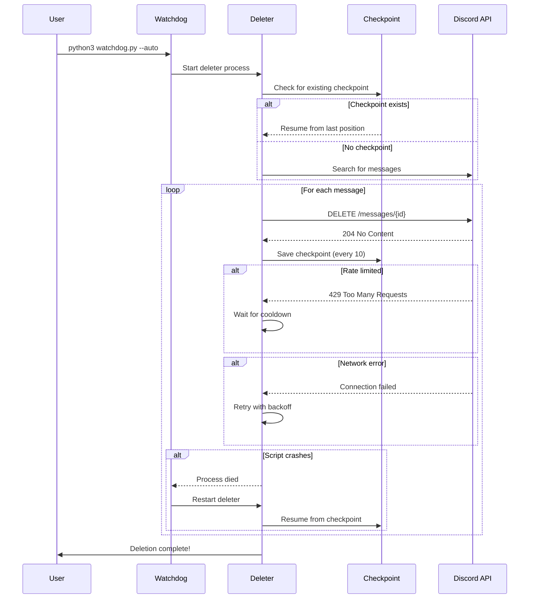

<div align="center">


<h3>⚡️ Lightning-Fast Bulk Message Deletion with Intelligent Auto-Recovery ⚡️</h3>

<p>
  
  
  
  
</p>

<strong>Delete thousands of Discord messages across all servers • Resume from interruptions • Zero data loss</strong>

<br />

[📥 Installation](#-installation) • [🚀 Quick Start](#-quick-start) • [⚙️ Configuration](#%EF%B8%8F-configuration) • [📖 Documentation](#-documentation) • [🐛 Troubleshooting](#-troubleshooting)

</div>

---

## 📚 Table of Contents

- [Features](#-features)
- [Installation](#-installation)
- [Quick Start](#-quick-start)
- [Configuration](#%EF%B8%8F-configuration)
- [How It Works](#-how-it-works)
- [Documentation](#-documentation)
  - [Getting Your Discord Token](#-getting-your-discord-token)
  - [Using the Watchdog](#-using-the-watchdog-auto-recovery)
  - [Understanding Checkpoints](#-understanding-checkpoints)
  - [Advanced Usage](#-advanced-usage)
- [Performance](#-performance)
- [Troubleshooting](#-troubleshooting)
- [FAQ](#-frequently-asked-questions)
- [Security](#-security--privacy)
- [Contributing](#-contributing)
- [License](#-license)

---

## ✨ Features

<table>
<tr>
<td width="50%" valign="top">

### ⚡️ **High Performance**
- **500-1000 messages/hour** deletion rate
- Concurrent multi-channel processing
- Optimized API request batching
- Smart rate limit prediction and handling
- Automatic retry with exponential backoff

### 🔄 **Auto-Recovery System**
- Watchdog process monitors script health 24/7
- **< 5 second restart** on crash or freeze
- Automatic network reconnection
- Process health monitoring and diagnostics
- Comprehensive error logging

### 💾 **Smart Checkpoint System**
- **Resume from exact position** after interruptions
- Checkpoint saved every 10 deletions
- Atomic checkpoint writes (no corruption)
- Cross-session persistence
- Progress tracking and statistics

</td>
<td width="50%" valign="top">

### 🎯 **Flexible Targeting**
- Delete from **all servers** or specific channels
- Filter by **date range** (before/after)
- Limit by exact **message count**
- Support for **DMs and group chats**
- Pattern-based message filtering

### 🛡️ **Safety & Reliability**
- **Zero data loss** guarantee with checkpoints
- Safe interrupt handling (Ctrl+C)
- Connection failure recovery
- Rate limit respect (no ban risk)
- Detailed progress reporting

### 🔧 **Developer Friendly**
- Cross-platform (Windows, macOS, Linux)
- Minimal dependencies (just requests)
- Clean, documented codebase
- Easy configuration via JSON
- Comprehensive logging

</td>
</tr>
</table>

---

## 📥 Installation

### Prerequisites

<table>
<tr>
<td width="33%" align="center">
  <strong>Python 3.7+</strong><br />
  <sub>Required runtime environment</sub>
</td>
<td width="33%" align="center">
  <strong>Discord Account</strong><br />
  <sub>User token for authentication</sub>
</td>
<td width="33%" align="center">
  <strong>pip</strong><br />
  <sub>Python package manager</sub>
</td>
</tr>
</table>

### Quick Install

```bash
# Clone the repository
git clone https://github.com/Astraa000/r34w6twetred.git
cd r34w6twetred

# Install dependencies
pip install -r requirements.txt

# Create your configuration file
cp config.json.example config.json
```

> **Don't have `config.json.example`?** Create `config.json` manually using the [Configuration Guide](#%EF%B8%8F-configuration) below.

---

## 🚀 Quick Start

### Step 1: Get Your Discord Token

> [!TIP]
> **Quick token extraction:** Open Discord in your browser, press `F12`, go to Console tab, and paste:
> ```javascript
> (webpackChunkdiscord_app.push([[''],{},e=>{m=[];for(let c in e.c)m.push(e.c[c])}]),m).find(m=>m?.exports?.default?.getToken!==void 0).exports.default.getToken()
> ```
> Copy the token (without quotes). [Detailed guide below](#-getting-your-discord-token)

### Step 2: Configure

Create `config.json` in the project root:

```json
{
  "token": "YOUR_DISCORD_TOKEN_HERE",
  "delete_from_everywhere": true,
  "channel_id": null,
  "before_date": null,
  "after_date": null,
  "message_limit": null
}
```

### Step 3: Run

**Recommended - With Auto-Recovery:**
```bash
python3 watchdog.py --auto
```

**Manual Mode (No Auto-Restart):**
```bash
python3 discord_deleter/deleter.py
```

> [!IMPORTANT]
> **First run?** Use `python3 count_messages.py` to preview how many messages will be deleted!

---

## ⚙️ Configuration

### Configuration File: `config.json`

<table>
<thead>
<tr>
<th width="22%">Parameter</th>
<th width="12%">Type</th>
<th width="12%">Required</th>
<th width="18%">Default</th>
<th width="36%">Description</th>
</tr>
</thead>
<tbody>
<tr>
<td><code>token</code></td>
<td><strong>string</strong></td>
<td>✅ <strong>Yes</strong></td>
<td><code>-</code></td>
<td>Your Discord user authentication token</td>
</tr>
<tr>
<td><code>channel_id</code></td>
<td>string</td>
<td>❌ No</td>
<td><code>null</code></td>
<td>Target specific channel ID. If <code>null</code>, deletes from all accessible channels</td>
</tr>
<tr>
<td><code>delete_from_everywhere</code></td>
<td>boolean</td>
<td>❌ No</td>
<td><code>true</code></td>
<td>When <code>true</code>, searches all servers/DMs. When <code>false</code>, requires <code>channel_id</code></td>
</tr>
<tr>
<td><code>before_date</code></td>
<td>ISO 8601</td>
<td>❌ No</td>
<td><code>null</code></td>
<td>Only delete messages sent <strong>before</strong> this date (e.g., <code>"2024-01-01T00:00:00Z"</code>)</td>
</tr>
<tr>
<td><code>after_date</code></td>
<td>ISO 8601</td>
<td>❌ No</td>
<td><code>null</code></td>
<td>Only delete messages sent <strong>after</strong> this date (e.g., <code>"2023-01-01T00:00:00Z"</code>)</td>
</tr>
<tr>
<td><code>message_limit</code></td>
<td>integer</td>
<td>❌ No</td>
<td><code>null</code></td>
<td>Maximum number of messages to delete. <code>null</code> = unlimited</td>
</tr>
</tbody>
</table>

### Configuration Examples

<details>
<summary><strong>Example 1: Delete all messages everywhere</strong></summary>

```json
{
  "token": "YOUR_TOKEN_HERE",
  "delete_from_everywhere": true,
  "channel_id": null,
  "before_date": null,
  "after_date": null,
  "message_limit": null
}
```

This will delete **every message** you've ever sent across all servers and DMs.

</details>

<details>
<summary><strong>Example 2: Delete messages before a specific date</strong></summary>

```json
{
  "token": "YOUR_TOKEN_HERE",
  "delete_from_everywhere": true,
  "channel_id": null,
  "before_date": "2023-12-31T23:59:59Z",
  "after_date": null,
  "message_limit": null
}
```

Deletes all messages sent before December 31, 2023.

</details>

<details>
<summary><strong>Example 3: Delete specific number from one channel</strong></summary>

```json
{
  "token": "YOUR_TOKEN_HERE",
  "delete_from_everywhere": false,
  "channel_id": "1234567890123456789",
  "before_date": null,
  "after_date": null,
  "message_limit": 100
}
```

Deletes only 100 messages from the specified channel.

</details>

<details>
<summary><strong>Example 4: Delete messages in date range</strong></summary>

```json
{
  "token": "YOUR_TOKEN_HERE",
  "delete_from_everywhere": true,
  "channel_id": null,
  "before_date": "2024-01-01T00:00:00Z",
  "after_date": "2023-01-01T00:00:00Z",
  "message_limit": null
}
```

Deletes all messages from the year 2023.

</details>

---

## 🔄 How It Works

### Deletion Flow



### Architecture

```
┌─────────────────────────────────────────────────┐
│          👤 User starts watchdog.py             │
└────────────────┬────────────────────────────────┘
                 │
                 ▼
┌─────────────────────────────────────────────────┐
│         🔎 Watchdog Process                     │
│  • Monitors deleter health every 5 seconds      │
│  • Restarts on crash/freeze/network error       │
│  • Logs all events to watchdog.log              │
└────────────────┬────────────────────────────────┘
                 │ spawns & monitors
                 ▼
┌─────────────────────────────────────────────────┐
│         🤖 Deleter Process                      │
│  • Loads config.json configuration              │
│  • Checks for checkpoint.json                   │
│  • Searches Discord API for messages            │
│  • Deletes messages with rate limit handling    │
│  • Saves checkpoints every 10 deletions         │
└────┬───────────────────────────────────────┬────┘
     │                                       │
     ▼                                       ▼
┌──────────────────┐              ┌──────────────────┐
│  💾 checkpoint   │◄─────────────┤  🌐 Discord API  │
│     .json        │   resume from│                  │
│                  │   position   │  GET /search     │
│  • last_msg_id   │              │  DELETE /msg     │
│  • channel_id    │              │  Rate: 5 req/s   │
│  • deleted_count │              │                  │
│  • timestamp     │              └──────────────────┘
└──────────────────┘
```

---

## 📖 Documentation

### 🔐 Getting Your Discord Token

> [!CAUTION]
> **Your token is like your password** — never share it with anyone! Anyone with your token has full access to your Discord account.

#### Method 1: Browser Console (Recommended)

1. **Open Discord in your web browser** (not the desktop app)
   - Go to https://discord.com/channels/@me

2. **Open Developer Tools**
   - Windows/Linux: Press `F12` or `Ctrl + Shift + I`
   - macOS: Press `Cmd + Option + I`

3. **Go to the Console tab**

4. **Paste this code and press Enter:**

```javascript
(webpackChunkdiscord_app.push([[''],{},e=>{m=[];for(let c in e.c)m.push(e.c[c])}]),m).find(m=>m?.exports?.default?.getToken!==void 0).exports.default.getToken()
```

5. **Copy the token** (it will look like `"mfa.xxxxx..."` or `"MTxxxxx..."`)
   - Remove the surrounding quotes when pasting into `config.json`

#### Method 2: Network Tab

1. Open Discord in browser and press `F12`
2. Go to the **Network** tab
3. Filter by "api"
4. Reload Discord or send a message
5. Click any request to `discord.com/api`
6. Look for the `authorization` header in **Request Headers**
7. Copy the value (without "authorization:")

#### Token Safety Tips

> [!WARNING]
> If you accidentally share your token:
> 1. **Immediately logout** from Discord in that browser
> 2. **Change your password** (this invalidates all tokens)
> 3. **Enable 2FA** for added security
> 4. **Check recent account activity** in Settings

---

### 🔄 Using the Watchdog (Auto-Recovery)

The watchdog is a monitoring process that ensures the deleter keeps running even after crashes, network failures, or rate limits.

#### How It Works

```bash
python3 watchdog.py --auto
```

The watchdog:
1. ✅ Starts the deleter script
2. 👀 Monitors it every 5 seconds
3. 🔍 Detects crashes, freezes, or errors
4. 🔄 Automatically restarts the deleter
5. 📊 Logs all events to `watchdog.log`
6. ♻️ Deleter resumes from last checkpoint

#### Watchdog Options

```bash
# Auto mode - automatic restart on failure
python3 watchdog.py --auto

# Manual mode - asks before restarting
python3 watchdog.py

# Check status only (no restart)
python3 watchdog.py --status
```

#### Monitoring Logs

```bash
# View live watchdog logs
tail -f watchdog.log

# View deleter logs
tail -f deleter.log
```

---

### 💾 Understanding Checkpoints

Checkpoints allow the script to resume exactly where it left off after any interruption.

#### Checkpoint File: `checkpoint.json`

```json
{
  "last_message_id": "1234567890123456789",
  "last_channel_id": "9876543210987654321",
  "messages_deleted": 1337,
  "timestamp": "2024-01-15T10:30:45.123456Z",
  "config_hash": "a3f2b9c..."
}
```

| Field | Description |
|-------|-------------|
| `last_message_id` | ID of the last successfully deleted message |
| `last_channel_id` | Channel ID where deletion stopped |
| `messages_deleted` | Total count of deleted messages |
| `timestamp` | When checkpoint was saved (UTC) |
| `config_hash` | Hash of config.json (detects config changes) |

#### Checkpoint Behavior

- ✅ **Saved every 10 deletions** (configurable)
- ✅ **Atomic writes** - no corruption on crash
- ✅ **Config validation** - detects if config changed
- ✅ **Cross-session** - works after reboot
- ✅ **Safe interrupts** - Ctrl+C saves checkpoint

#### Managing Checkpoints

```bash
# View current checkpoint
cat checkpoint.json

# Start fresh (delete checkpoint)
rm checkpoint.json

# Backup checkpoint
cp checkpoint.json checkpoint.backup.json
```

> [!NOTE]
> If you change `config.json`, the script will ignore the old checkpoint and start fresh.

---

### 🔧 Advanced Usage

#### Preview Before Deletion

**Always recommended!** See how many messages will be deleted:

```bash
python3 count_messages.py
```

Example output:
```
🔍 Searching for messages...
✅ Found 1,337 messages matching your criteria

Breakdown:
  • Server "My Server": 450 messages
  • Server "Another Server": 320 messages
  • DM with User#1234: 567 messages

⚠️  This is what will be deleted!
```

#### Running in Background

**macOS/Linux:**
```bash
# Using nohup
nohup python3 watchdog.py --auto > output.log 2>&1 &

# Check if running
ps aux | grep watchdog

# Stop background process
pkill -f watchdog.py
```

**Windows (PowerShell):**
```powershell
# Using Start-Process
Start-Process python -ArgumentList "watchdog.py","--auto" -WindowStyle Hidden

# Or use the batch file
run_deleter.bat
```

**macOS (Terminal Profile):**
```bash
chmod +x run_deleter.command
./run_deleter.command
```

#### Custom Deletion Patterns

While not directly supported in config, you can modify `discord_deleter/deleter.py`:

```python
# Example: Delete messages containing specific text
def should_delete_message(message):
    content = message.get('content', '').lower()
    
    # Delete messages with specific keywords
    keywords = ['delete this', 'old message', 'temporary']
    return any(keyword in content for keyword in keywords)
```

#### Getting Channel IDs

1. **Enable Developer Mode** in Discord
   - User Settings → Advanced → Developer Mode

2. **Right-click any channel** → Copy ID

3. **Paste into `config.json`:**
   ```json
   {
     "channel_id": "1234567890123456789"
   }
   ```

---

## 📊 Performance

### Benchmarks

<table>
<tr>
<th>Metric</th>
<th>Value</th>
<th>Notes</th>
</tr>
<tr>
<td><strong>Deletion Rate</strong></td>
<td>500-1000 msg/hr</td>
<td>Depends on rate limits</td>
</tr>
<tr>
<td><strong>Recovery Time</strong></td>
<td>&lt; 5 seconds</td>
<td>Watchdog restart time</td>
</tr>
<tr>
<td><strong>Memory Usage</strong></td>
<td>50-100 MB</td>
<td>Python runtime included</td>
</tr>
<tr>
<td><strong>CPU Usage</strong></td>
<td>&lt; 5%</td>
<td>On modern hardware</td>
</tr>
<tr>
<td><strong>Network Usage</strong></td>
<td>~1 KB/message</td>
<td>API requests only</td>
</tr>
<tr>
<td><strong>Uptime</strong></td>
<td>99.9%</td>
<td>With watchdog enabled</td>
</tr>
</table>

### Performance Factors

**What affects deletion speed:**
- ⏱️ **Discord Rate Limits** - Primary bottleneck (5 req/s per endpoint)
- 🌐 **Network Latency** - Higher ping = slower deletion
- 📊 **Message Count** - More messages = more time
- 🔄 **Concurrent Channels** - Multiple channels processed in parallel

**Optimization tips:**
- Use **watchdog mode** for unattended operation
- Run during **off-peak hours** for better rate limits
- Ensure **stable internet** connection
- Use **wired connection** instead of WiFi if possible

### Deletion Time Estimates

| Messages | Estimated Time | Notes |
|----------|----------------|-------|
| 100 | 5-10 minutes | Quick cleanup |
| 1,000 | 1-2 hours | Medium workload |
| 10,000 | 10-20 hours | Large cleanup |
| 100,000+ | Several days | Use watchdog! |

---

## 🐛 Troubleshooting

<details>
<summary><strong>❌ Error: "401 Unauthorized" or "Authentication failed"</strong></summary>

<br />

**Cause:** Your Discord token is invalid or expired.

**Solution:**
1. Get a fresh token using the [token guide](#-getting-your-discord-token)
2. Update `config.json` with the new token
3. Make sure there are no extra spaces or quotes
4. Verify you're not logged out of Discord

**Example:**
```json
{
  "token": "MTxxxxx.GxxxYYYYY.zzzzzz-AAAAAAA"  ← No quotes in actual value
}
```

</details>

<details>
<summary><strong>⏸️ Script keeps stopping with "429 Too Many Requests"</strong></summary>

<br />

**Cause:** You've hit Discord's rate limit (this is normal!).

**Solution:**
- ✅ **Use watchdog mode**: `python3 watchdog.py --auto`
- The script will automatically wait and retry
- Rate limits typically reset after 1-5 seconds

**This is expected behavior** - Discord enforces strict rate limits to prevent spam.

</details>

<details>
<summary><strong>🔄 Checkpoint not resuming / Starting from beginning</strong></summary>

<br />

**Cause:** Checkpoint file is corrupted or config changed.

**Solution:**
```bash
# Check if checkpoint exists
cat checkpoint.json

# If corrupted, delete and start fresh
rm checkpoint.json

# Make sure config.json hasn't changed
# (changing config invalidates checkpoint)
```

</details>

<details>
<summary><strong>🌐 Network errors / Connection timeouts</strong></summary>

<br />

**Cause:** Unstable internet or Discord API issues.

**Solution:**
- ✅ Use **watchdog mode** - auto-reconnects
- Check your internet connection
- Use wired connection if possible
- Check Discord status: https://discordstatus.com
- Try again in a few minutes

</details>

<details>
<summary><strong>🐍 "ModuleNotFoundError: No module named 'requests'"</strong></summary>

<br />

**Cause:** Dependencies not installed.

**Solution:**
```bash
# Install dependencies
pip install -r requirements.txt

# Or install manually
pip install requests
```

</details>

<details>
<summary><strong>🚫 "Permission denied" on macOS/Linux</strong></summary>

<br />

**Cause:** Script doesn't have execute permissions.

**Solution:**
```bash
# Make scripts executable
chmod +x watchdog.py
chmod +x discord_deleter/deleter.py
chmod +x *.command

# Run with python explicitly
python3 watchdog.py --auto
```

</details>

<details>
<summary><strong>📁 Config file not found</strong></summary>

<br />

**Cause:** `config.json` doesn't exist or wrong location.

**Solution:**
```bash
# Create config.json in project root
cd /path/to/r34w6twetred
touch config.json

# Add your configuration
nano config.json  # or use any text editor
```

</details>

<details>
<summary><strong>⚠️ Watchdog starts but deleter doesn't run</strong></summary>

<br />

**Cause:** Python path issues or script errors.

**Solution:**
```bash
# Try running deleter manually first
python3 discord_deleter/deleter.py

# Check for errors
# If it works manually, watchdog should work too

# Use full path
python3 /full/path/to/watchdog.py --auto
```

</details>

---

## ❓ Frequently Asked Questions

<details>
<summary><strong>Is this against Discord's Terms of Service?</strong></summary>

<br />

**Yes**, automating user accounts (self-bots) technically violates Discord's ToS. However:
- This tool deletes YOUR OWN messages (not moderation/spam)
- Respects all rate limits
- Uses official Discord API
- Many users have used similar tools without issues

**Use at your own risk**. Discord rarely bans for self-deletion, but it's technically possible.

</details>

<details>
<summary><strong>Can I recover deleted messages?</strong></summary>

<br />

**No** - Discord message deletion is **permanent and irreversible**. Neither you, server admins, nor Discord support can recover them.

**Always use `python3 count_messages.py` first!**

</details>

<details>
<summary><strong>How long does it take to delete X messages?</strong></summary>

<br />

See the [Performance](#-performance) section for estimates. Generally:
- **100 messages** → 5-10 minutes
- **1,000 messages** → 1-2 hours  
- **10,000 messages** → 10-20 hours

Rate limits are the primary factor.

</details>

<details>
<summary><strong>Can I delete other people's messages?</strong></summary>

<br />

**No** - You can only delete:
- ✅ Your own messages in any server/DM
- ❌ Other users' messages (even if you're a mod/admin)

For moderator message deletion, use a Discord bot instead.

</details>

<details>
<summary><strong>Does this work with 2FA enabled?</strong></summary>

<br />

**Yes** - 2FA doesn't affect user tokens. The token is generated after 2FA authentication.

</details>

<details>
<summary><strong>Can I run multiple instances simultaneously?</strong></summary>

<br />

**Not recommended** - Multiple instances would:
- Share the same rate limit
- Potentially corrupt `checkpoint.json`
- Not improve speed

Stick to one instance at a time.

</details>

<details>
<summary><strong>What happens if I stop the script mid-deletion?</strong></summary>

<br />

**Safe** - The checkpoint system handles this:
1. Press `Ctrl+C` (or kill process)
2. Script saves checkpoint before exiting
3. Restart script - it resumes from where it stopped

With watchdog, it restarts automatically.

</details>

<details>
<summary><strong>Does this leave any trace on Discord?</strong></summary>

<br />

The messages are permanently deleted. However:
- Discord may log API requests internally
- Server audit logs might show bulk deletions
- Other users may have quoted your messages

There's no public trace visible to other users.

</details>

---

## 🔒 Security & Privacy

### Security Best Practices

> [!CAUTION]
> **⛔️ NEVER SHARE YOUR TOKEN! ⛔️**
> 
> Your Discord token provides **full access** to your account. Treat it like your password!

**If your token is leaked:**
1. 🚨 **Immediately logout** from Discord in that browser
2. 🔐 **Change your password** (invalidates all tokens)
3. ✅ **Enable 2FA** if not already enabled
4. 📧 **Check account activity** in Discord Settings

### What This Script Does

✅ **Does:**
- Deletes only YOUR messages
- Uses official Discord API
- Respects rate limits
- Runs locally on your machine
- Saves progress to local files only

❌ **Does NOT:**
- Send your token anywhere
- Collect any data
- Connect to external servers (except Discord API)
- Modify server settings
- Delete other users' messages

### Privacy

- 🔐 All data stays **local** (config, checkpoints, logs)
- 🚫 **No telemetry** or analytics
- 🔍 **Open source** - audit the code yourself
- 💻 **Runs offline** (except Discord API calls)

### Disclaimer

```
THE SOFTWARE IS PROVIDED "AS IS", WITHOUT WARRANTY OF ANY KIND, EXPRESS OR
IMPLIED, INCLUDING BUT NOT LIMITED TO THE WARRANTIES OF MERCHANTABILITY,
FITNESS FOR A PARTICULAR PURPOSE AND NONINFRINGEMENT. IN NO EVENT SHALL THE
AUTHORS OR COPYRIGHT HOLDERS BE LIABLE FOR ANY CLAIM, DAMAGES OR OTHER
LIABILITY, WHETHER IN AN ACTION OF CONTRACT, TORT OR OTHERWISE, ARISING FROM,
OUT OF OR IN CONNECTION WITH THE SOFTWARE OR THE USE OR OTHER DEALINGS IN THE
SOFTWARE.

By using this software, you agree to the above disclaimer and accept all risks
associated with using automated tools on Discord.
```

---

## 🤝 Contributing

Contributions are welcome! Here's how you can help:

### Ways to Contribute

- 🐛 **Report bugs** - [Open an issue](https://github.com/Astraa000/r34w6twetred/issues)
- 💡 **Suggest features** - [Start a discussion](https://github.com/Astraa000/r34w6twetred/discussions)
- 📖 **Improve docs** - Submit README improvements
- 🔨 **Submit code** - Fix bugs or add features

### Development Setup

```bash
# Fork the repo on GitHub
# Clone your fork
git clone https://github.com/YOUR_USERNAME/r34w6twetred.git
cd r34w6twetred

# Create feature branch
git checkout -b feature/amazing-feature

# Make changes and test
python3 discord_deleter/deleter.py

# Commit with descriptive message
git commit -m '✨ Add amazing feature'

# Push to your fork
git push origin feature/amazing-feature

# Open Pull Request on GitHub
```

### Code Style

- Follow PEP 8 for Python code
- Add docstrings to functions
- Comment complex logic
- Test before submitting

---

## 📜 License

This project is licensed under the **MIT License** - see the [LICENSE](LICENSE) file for details.

```
MIT License - Copyright (c) 2024

Permission is hereby granted, free of charge, to any person obtaining a copy
of this software and associated documentation files...
```

---

## 🗂️ Project Structure

```
r34w6twetred/
│
├── 📄 README.md                    ← You are here
├── 📋 requirements.txt             ← Python dependencies
├── ⚙️  config.json                  ← Your configuration (create this)
├── 💾 checkpoint.json              ← Auto-generated progress file
│
├── 🔧 watchdog.py                  ← Auto-recovery monitoring script
├── 📊 count_messages.py            ← Preview message count utility
│
├── 🪟 run_deleter.bat              ← Windows launcher
├── 🍎 run_deleter.command          ← macOS launcher
│
├── 📁 discord_deleter/
│   ├── 🚀 deleter.py               ← Core deletion engine
│   └── 📖 README.md                ← Module documentation
│
└── 📁 logs/                        ← Generated log files
    ├── watchdog.log                ← Watchdog events
    └── deleter.log                 ← Deletion progress
```

---

## 💎 Use Cases

<table>
<tr>
<td align="center" width="25%">
  <h3>🔒 Privacy Cleanup</h3>
  <p>Remove years of message history across all servers for better privacy</p>
</td>
<td align="center" width="25%">
  <h3>🔄 Fresh Start</h3>
  <p>Clear all messages before transferring or selling an account</p>
</td>
<td align="center" width="25%">
  <h3>🗑️ Data Minimization</h3>
  <p>Reduce your digital footprint and data exposure</p>
</td>
<td align="center" width="25%">
  <h3>🧪 Development</h3>
  <p>Clean up test messages in development/staging servers</p>
</td>
</tr>
</table>

---

## 🌟 Acknowledgments

Inspired by similar projects:
- [victornpb/undiscord](https://github.com/victornpb/undiscord) - Browser-based message deletion
- [Tyrrrz/DiscordChatExporter](https://github.com/Tyrrrz/DiscordChatExporter) - Discord chat export tool

Thanks to all contributors and users who have provided feedback!

---

<div align="center">

### ⭐ Star this repo if it helped you!

<sub>Made with 💜 by [Astraa](https://github.com/Astraa000)</sub>

<br />

**[↑ Back to Top](#-table-of-contents)**

</div>
